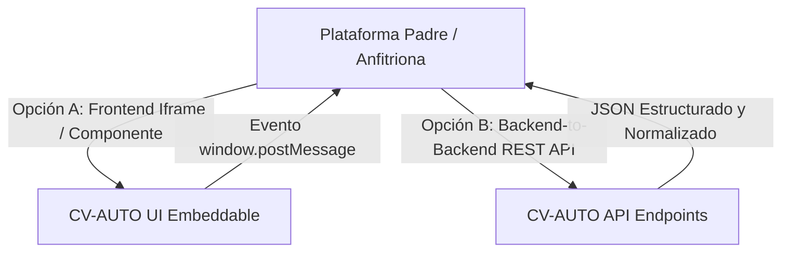

# 🔌 Guía de Integración Modular de CV-AUTO en Plataformas Padre

> **Propósito:** Esta guía documenta los métodos de integración para incrustar **CV-AUTO** como un módulo de admisión, onboarding y optimización de hojas de vida dentro de cualquier plataforma anfitriona (bolsas de empleo, plataformas de talento, ATS corporativos o comunidades de profesionales).

---

## 📐 1. Modelos de Integración Disponibles

CV-AUTO ofrece **dos modalidades de integración desacopladas**:



---

## 🌐 2. Integración Frontend: Modo Incrustado (Iframe & PostMessage)

Permite incrustar la interfaz visual completa de CV-AUTO dentro de un modal, paso de asistente (Wizard) o pestaña del perfil de usuario en la plataforma anfitriona.

### A. URL de Incrustación
Para habilitar el modo embebido, añade el parámetro `?embedded=true`:
```html
<iframe
  id="cv-auto-frame"
  src="https://tu-dominio-cv-auto.com/?embedded=true"
  style="width: 100%; height: 850px; border: none; border-radius: 12px;"
  allow="clipboard-write"
></iframe>
```

### B. Recepción de Datos vía `window.postMessage`
Cuando el candidato optimiza su CV y pulsa el botón **"Guardar en Plataforma"**, CV-AUTO emite automáticamente un evento `postMessage`:

```typescript
import { subscribeToCvModuleEvents, CvModuleOutput } from './module/CvModuleContract';

// Opción 1: Usando la utilidad oficial de CV-AUTO
const unsubscribe = subscribeToCvModuleEvents((output: CvModuleOutput) => {
  console.log('Puntaje ATS alcanzado:', output.audit.overallScore);
  console.log('Datos normalizados del candidato:', output.candidatePayload);

  // Guardar en la base de datos de tu plataforma
  guardarCandidatoEnBaseDeDatos(output.candidatePayload);
});

// Opción 2: Escuchando nativamente en Javascript
window.addEventListener('message', (event) => {
  if (event.data?.type === 'CV_AUTO_MODULE_COMPLETE') {
    const payload = event.data.payload;
    console.log('Candidato Aprobado:', payload);
  }
});
```

---

## ⚡ 3. Integración Backend: Consumo Directo de la API REST

Si tu plataforma prefiere procesar y calificar CVs en segundo plano sin mostrar la interfaz de CV-AUTO:

### Endpoint: `POST /api/cv/export-structured`
Recibe el objeto de la hoja de vida, ejecuta la auditoría ATS 2026 y devuelve un JSON normalizado listo para bases de datos relacionales o NoSQL.

#### Solicitud (Headers: `Content-Type: application/json`):
```json
{
  "resume": {
    "contact": {
      "fullName": "Alejandro Morales",
      "email": "alejandro@email.com",
      "phone": "+57 310 123 4567",
      "location": "Bogotá, Colombia",
      "professionalTitle": "Senior Full Stack Engineer"
    },
    "summary": "Ingeniero de Software con más de 5 años de experiencia...",
    "experience": [
      {
        "company": "Tech Corp",
        "position": "Líder Técnico",
        "startDate": "2021-01",
        "endDate": "Presente",
        "bulletPoints": [
          "Optimicé microservicios reduciendo latencia en un 35%."
        ]
      }
    ],
    "skillsList": ["TypeScript", "Node.js", "Docker", "AWS"]
  }
}
```

#### Respuesta (200 OK):
```json
{
  "success": true,
  "candidatePayload": {
    "exportedAt": "2026-10-07T06:01:10.451Z",
    "candidate": {
      "fullName": "Alejandro Morales",
      "email": "alejandro@email.com",
      "phone": "+57 310 123 4567",
      "location": "Bogotá, Colombia",
      "linkedin": null,
      "github": null,
      "professionalTitle": "Senior Full Stack Engineer",
      "hasPhoto": false
    },
    "profileSummary": "Ingeniero de Software con más de 5 años...",
    "atsEvaluation": {
      "overallScore": 88,
      "rating": "ATS Ready",
      "passedAtsChecks": 6,
      "criticalFixesRemaining": 0,
      "metricsRatio": 1,
      "hasBreakingElements": false
    },
    "workHistory": [
      {
        "company": "Tech Corp",
        "role": "Líder Técnico",
        "duration": "2021-01 - Presente",
        "achievements": ["Optimicé microservicios reduciendo latencia en un 35%."]
      }
    ],
    "education": [],
    "skills": {
      "flatList": ["TypeScript", "Node.js", "Docker", "AWS"],
      "categories": []
    }
  }
}
```

---

## 🛠️ 4. Servicios Heurísticos Locales Disponibles

La plataforma madre puede invocar los microservicios heurísticos de forma independiente:

| Endpoint | Método | Entrada | Salida | Uso |
| :--- | :--- | :--- | :--- | :--- |
| `/api/optimizer/suggest-bullets` | `POST` | `{ "bullet": "string" }` | 3 alternativas Google XYZ con motivos | Reescritura de viñetas en 1 clic. |
| `/api/optimizer/generate-summary` | `POST` | `{ "resume": ResumeData, "tone": "tech" }` | Resumen de 3-4 líneas | Creación de perfil profesional rápido. |
| `/api/optimizer/remote-skills` | `GET` | N/A | Lista de 14 habilidades remotas y verbos | Sugerencias de palabras clave de mercado. |
| `/api/cv/export-pdf` | `POST` | `{ "resume": ResumeData, "template": "ats-harvard" }` | Archivo binario `application/pdf` | Descarga de PDF vectorial compilado. |
| `/api/cv/export-docx` | `POST` | `{ "resume": ResumeData }` | Archivo binario `.docx` | Descarga de Word editable. |
